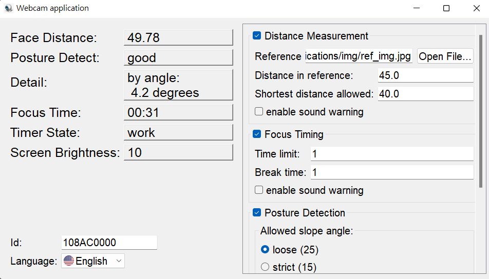

# A system of student engagement analysis and self-adjusting eye protection

Under the impact of coronavirus, online teaching has become a common teaching model. For those teachers, it is a big challenge to attract the students in online classes. Because of online teaching, the teachers are hard to know the degree of concentration (DoC) of students during class, so they can't adjust their teaching tempo immediately.  \
This study combines many techniques, such as **face detection**, **deep learning**, and **fuzzy control**. We also design algorithms to extract the students' states during class, which can then generate several metrics like **distance**, **posture**, and **blinking rate**. Moreover, we use these metrics to grade the DoCs of students and to present the changes of DoCs by means of charts. During online teaching, the DoCs are transmitted to teachers so that they can instantly know the reactions of their students. \
Lower complexity and hardware requirement are obtained in comparison with former theses, and we have all sources opened to share with teacher and students.

## Student-end

The **GUI view** of the *Student-end*. \

## Teacher-end

The **monitor view** of the *Teacher-end*. \

The **history plot** after the grade of a specific student is clicked. \

