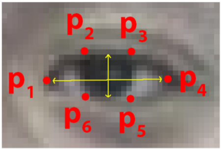

# blink module: detecting blinks

## Basics

We've obtained the 64 face landmarks with *Dlib* before this module; in this module, `BlinkDetector` extracts 6 landmarks from each eyes (fig. 1) and tracks the changes on **Eye Aspect Ratio**s (*EAR*), which is
defined by (|P2-P6| + |P3-P5|) / (2|P1-P4|). *EAR* shows shape of the eye. When an eye closed, its *EAR* drops and approaches 0 theoretically.

 \
fig. 1

## Tracking change points

A **sliding window** is used to track the changes of **standard deviation** on current *EAR*s (fig. 2), if the standard deviation increases dramatically, there's a possible blink.

 \
fig. 2

See more details at [EE-Ind-Stud-Group/blink-detection#change-point-detection](https://github.com/EE-Ind-Stud-Group/blink-detection#change-point-detection).
