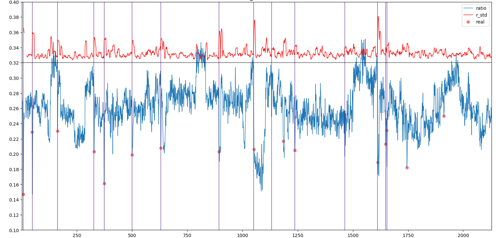

# blink module: detecting blinks

## Implemention

### Eye Aspect Ratio (EAR)

T. Soukupová and J. Čech found out that the eye aspect ratio, which is defined as the ratio of the height and width of the eye, changes between opened and closed eyes, and so we can detect the moment of blink by observing whether the *EAR* drops below a specific *threshould* [1].
But a static *threshold* fails under different situations and a dynamic one is hard to find.
Instead of using fancy *SVM*, we generalize the blink detection problem to a **change point problem**.
When a blink is made, the EAR changes dramatically and rapidly.

- *EAR* is defined by (|P2-P6| + |P3-P5|) / (2|P1-P4|).

### Change Point Detection

The following GIF illustrates how a window-based change point detection works with the standard deviation (*STD*) as its *cost function* [2].

The critical parameters are

1. `WINDOW_SIZE`: size of the window
1. `DRAMATIC_STD_CHANGE`: how dramatic the change in *STD* is to be considered as a change point

These parameters control how sensitive the detection is.
In the implemention, we only look at the *STD* change between 2 successive points, one may look at 3 or more of them, and define the occurrence of specific relation to be a blink (change point).
The following picture shows the result of a 3 minutes blink detection with `WINDOW_SIZE = 9` and `DRAMATIC_STD_CHANGE = 0.008`.
Vertical lines are the blinks that are detected.

## References

- [1] T. Soukupová and J. Čech, "Real-Time Eye Blink Detection using Facial Landmarks," Proc. of Computer Vision Winter Workshop, 2016.
- [2] [Time Traveling with Data Science: Focusing on Change Point Detection in Time Series Analysis](https://www.iese.fraunhofer.de/blog/change-point-detection/)
