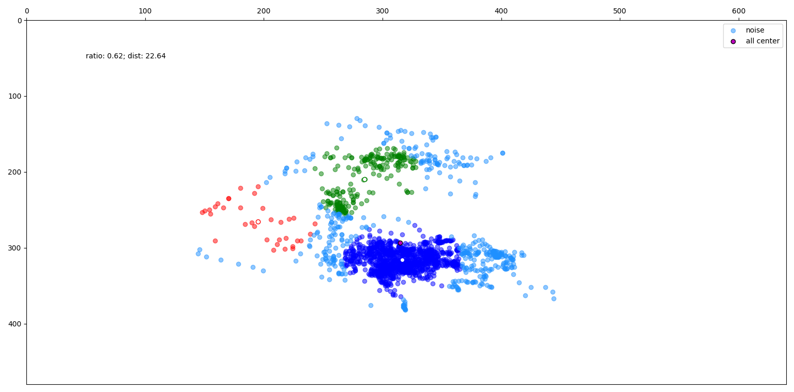

# Face center

We try to track the movement of the user. \
When the users are concentrating, usually their faces stick to a certain area. \
So by plotting the center point of faces (nose) and calculating how dense they are, we're able to tell how concentrating the user may be.

## Implementation

We use **MeanShift** with *bandwidth* 50 to get the possible clusters. \
The reason why 50 is chosen is because we define the *proper concentrating area* to be a circle with radius 50. \
After the clustering, we get several clusters.

- We take the *biggest cluster* (with the most face center points) and calculate its *ratio* over all points. \
For example, if there are 1,000 center points and 600 of them are in the biggest cluster, then the ratio is 0.6. \
The larger the ratio (<= 1.0) is, the denser the points are, and so the more concentrating the user may be.
- We calculate the *distance* between the center of that biggest cluster and the center of all points. \
The shorter the distance is, the denser the points are, and so the more concentrating the user may be.

The 2 numbers calculated above, *ratio* and *distance*, are the indices we used to indicate how concentrating the user may be.

The following image is about a distracted user, shows the position of face center points, clusters and indices.

## Typical index values

Status             | Ratio      | Distance
-------------------|------------|---------
High Concentration | 0.9 ~ 1    | ~ 5
Middle             | 0.7 ~ 0.85 | 10 ~ 15
High Distraction   | 0.5 ~      | 15 ~ 55

The values don't cover the whole range and even overlap because their boundaries aren't that clear.
