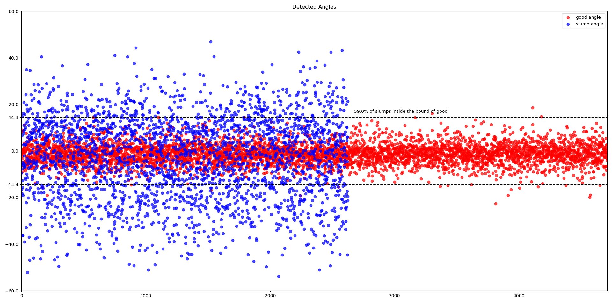

# posture module: detecting whether the posture of user slumps

## 2-layer detection model

This implementaion of posture detection is highly related with face detection, as well as **face angle detection**.

### layer 1: HOG (Dlib)

After a frame is captured, it first go through the *HOG* face detection
provided by *Dlib*.
This detection has more restrictions on the orientation and occlusion, but is **fast and accurate with clear faces**, so is placed at the 1st layer to solve most of the tasks.
If the face is detected successfully, we get the corresponding landmarks and utilize them to calculate the angle of face.

### layer 2: MTCNN

If the frame fails the detection of *HOG*, a 2nd face detection layer, *MTCNN*, is used.
The reason why it fails is usually because of large face rotation or severe occlusion, which *MTCNN* is especially good at.
*MTCNN* also provides landmarks, so we can calculate the angle.
Its greatest drawback is that it's about 10 times slower than *HOG*.

### no-face

A posture detection on no face is always considered as *slump* due to the absence of user.

## Relation between Posture and Face Angle

The following picture illustrates the relation between posture and face angle.
The input is 5,194 images labeled in **good** and 3,272 images labeled in **slump**, detected under layer 1 and 2.
You can see some results are missing because those images fail both layers, especially in the **slump** label.

